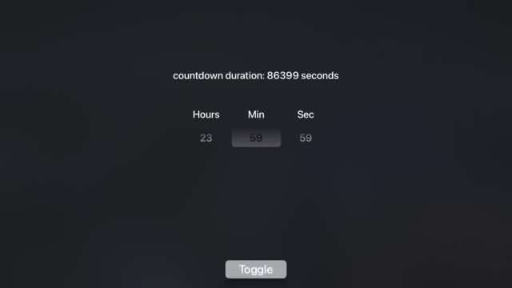
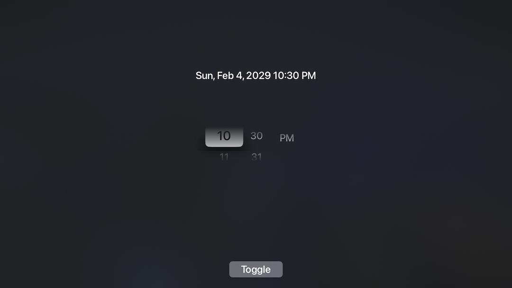
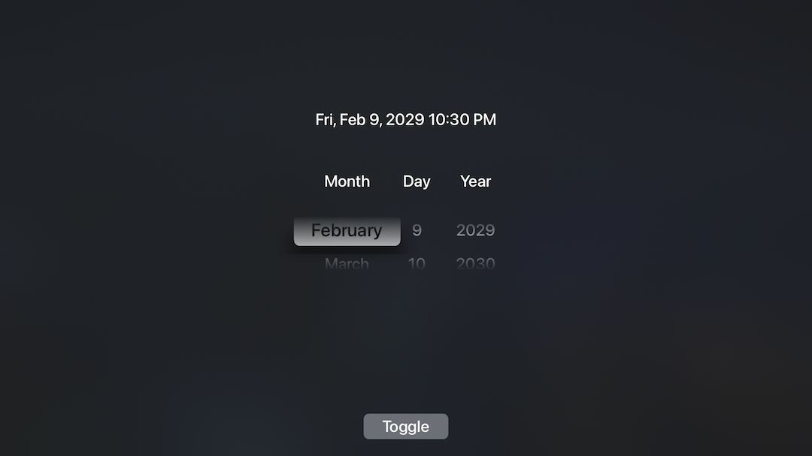
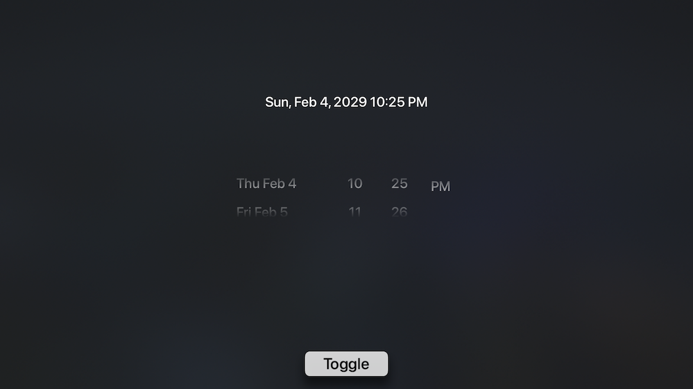
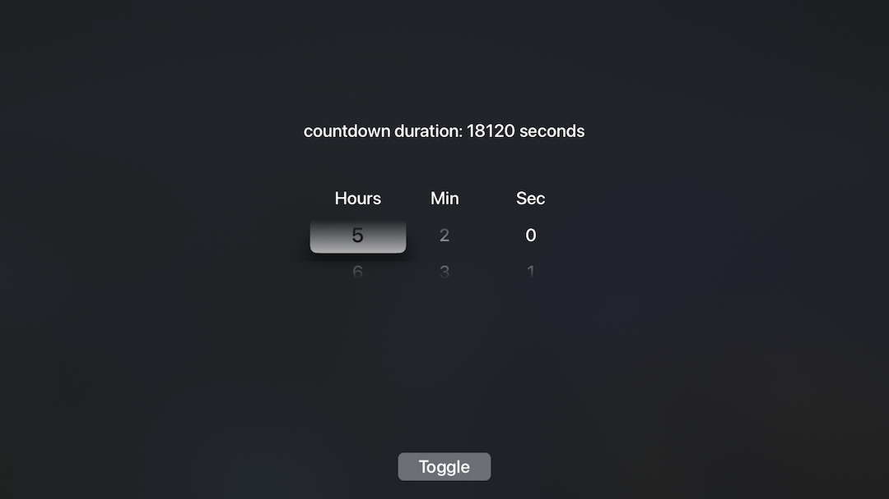

# KBDatePicker
UIDatePicker for tvOS! ported from https://github.com/jruhym/datePicker

This is only loosely affiliated with the swift version it was ported from at this point. I tried to make it API compatible and achieve some kind of feature parity with the iOS counterpart.

all 4 date picker modes are supported:

- KBDatePickerModeTime
- KBDatePickerModeDate
- KBDatePickerModeDateAndTime
- KBDatePickerModeCountDownTimer

4 of the most important properties are supported

- (NSDate *)date
- (NSDate *)minimumDate *
- (NSDate *)maximumDate *
- (NSTimeInterval)countDownDuration *

***minimum(maximum)Date aren't supported in KBDatePickerModeDateAndTime mode yet***

## Usage

In the near future I will try to make this work w/ CocoaPods and Carthage, for now just grab the KBDatePicker/KBDatePicker folder (with KBDatePickerView.h/m and Macros.h in it) and
add that to your project.

Adding the control & listening for control events is the same as any other UIControl (same as UI*Picker* iOS counterparts)

```Objective-C

#import "KBDatePickerView.h"

- (void)addDatePicker {
    KBDatePickerView *datePickerView = [KBDatePickerView new];
    datePickerView.translatesAutoresizingMaskIntoConstraints = false;
    [self.view addSubview:datePickerView];
    
    //would center the view obviously optional!
    [datePickerView.centerYAnchor constraintEqualToAnchor:self.view.centerYAnchor].active = true;
    [datePickerView.centerXAnchor constraintEqualToAnchor:self.view.centerXAnchor].active = true;
    
    //listen for changes
    [datePickerView addTarget:self action:@selector(datePickerChanged:) forControlEvents:UIControlEventValueChanged];
    
    //use a countdown timer instead
    [datePickerView setDatePickerMode:KBDatePickerModeCountDownTimer];
    [datePickerView setCountDownDuration:4205];
    
}

- (void)datePickerChanged:(KBDatePickerView *)dpv {
    NSLog(@"[KBDatePicker] changed: %@", dpv.date);
    if (dpv.datePickerMode == KBDatePickerModeCountDownTimer){
        NSString *time = [NSString stringWithFormat:@"countdown duration: %.0f seconds", dpv.countDownDuration];
        self.datePickerLabel.text = time;
    } else {
        NSDateFormatter *dateFormatter = [KBDatePickerView sharedDateFormatter];
        NSString *strDate = [dateFormatter stringFromDate:dpv.date];
        NSLog(@"strDate: %@", strDate); // Result: strDate: 2014/05/19 10:51:50
        self.datePickerLabel.text = strDate;
    }
    
}

```

## Troubleshooting

Sometimes you may have trouble directing the focus engine on and off of KBDatePicker, if this happens, i recommend creating focus guides similar to the ones created in the sample project. This sample below is assuming theres a toggle button like the one in the sample app and isnt code that will run on its own without substituting in the view you want the focus engine to redirect to.

```Objective-C

    UIFocusGuide *focusGuideLeft = [[UIFocusGuide alloc] init];
    [self.view addLayoutGuide:focusGuideLeft];
    [focusGuideLeft.topAnchor constraintEqualToAnchor:self.datePickerView.topAnchor].active = true;
    [focusGuideLeft.bottomAnchor constraintEqualToAnchor:self.datePickerView.bottomAnchor].active = true;
    [focusGuideLeft.widthAnchor constraintEqualToConstant:40].active = true;
    [focusGuideLeft.rightAnchor constraintEqualToAnchor:self.datePickerView.leftAnchor].active = true;
    focusGuideLeft.preferredFocusEnvironments = @[self.toggleTypeButton];
    
    UIFocusGuide *focusGuideRight = [[UIFocusGuide alloc] init];
    [self.view addLayoutGuide:focusGuideRight];
    [focusGuideRight.topAnchor constraintEqualToAnchor:self.datePickerView.topAnchor].active = true;
    [focusGuideRight.bottomAnchor constraintEqualToAnchor:self.datePickerView.bottomAnchor].active = true;
    [focusGuideRight.leftAnchor constraintEqualToAnchor:self.datePickerView.rightAnchor].active = true;
    [focusGuideRight.widthAnchor constraintEqualToConstant:40].active = true;
    focusGuideRight.preferredFocusEnvironments = @[self.toggleTypeButton];

```


## In Action




## Screenshots






