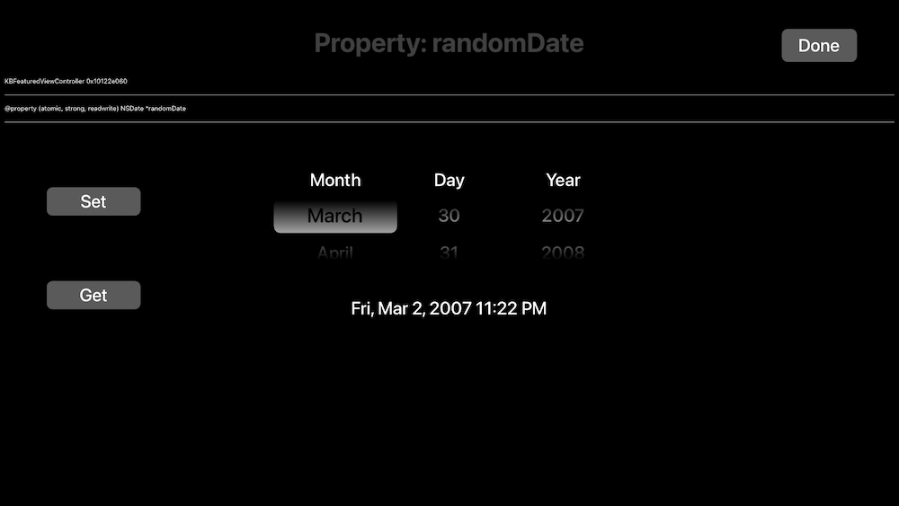
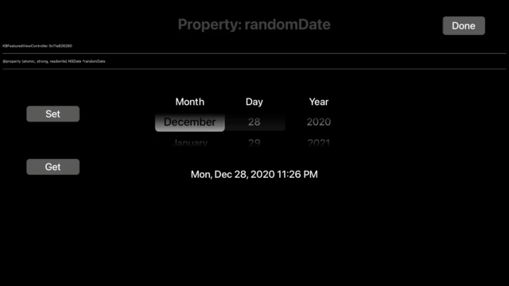

# KBDatePicker
UIDatePicker for tvOS! ported from https://github.com/jruhym/datePicker

This is only loosely affiliated with the swift version it was ported from at this point. I tried to make it API compatible and achieve some kind of feature parity with the iOS counterpart.

2 of the 4 date picker modes are supported:

- KBDatePickerModeTime
- KBDatePickerModeTime

3 of the most important properties are supported

- (NSDate *)date
- (NSDate *)minimumDate
- (NSDate *)maximumDate

Listening for control events is the same as any other UIControl (same as UI*Picker* iOS counterparts)

```Objective-C

[self.datePickerView addTarget:self action:@selector(datePickerChanged:) forControlEvents:UIControlEventValueChanged];

- (void)datePickerChanged:(KBDatePickerView *)dpv {
    NSLog(@"[KBDatePicker] changed: %@", dpv.date);
    NSDateFormatter *dateFormatter = [KBDatePickerView sharedDateFormatter];
    NSString *strDate = [dateFormatter stringFromDate:dpv.date];
    NSLog(@"strDate: %@", strDate); // Result: strDate: 2014/05/19 10:51:50
    self.datePickerLabel.text = strDate;
}
```



